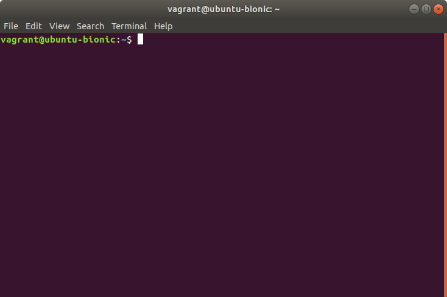

# Terminal


Say we want to show someone what we’re seeing in the terminal. A screenshot gives us full visual fidelity, but the text can’t be selected or inspected. This makes it harder to reproduce the situation, especially if any ambiguous characters (like 0 and O) are involved. Copying the text will lose the formatting, such as color. Formatted text to the rescue! You can copy and send an HTML snippet or file to get the best of both worlds.

For example, take this terminal window:



If you select the first line and use the context (or right–click) menu “Copy as HTML” option you get the following contents:

{lang="html"}
```
<pre><font color="#8AE234"><b>vagrant@ubuntu-bionic</b></font>:<font
 color="#729FCF"><b>~</b></font>$
</pre>
```

You can also use a program like `aha` to convert anything containing ANSI format characters to a full XHTML document:

{lang="console"}
```
$ grep --color=always foo <<< foobar | aha
<?xml version="1.0" encoding="UTF-8" ?>
<!DOCTYPE html PUBLIC "-//W3C//DTD XHTML 1.0 Strict//EN"
 "http://www.w3.org/TR/xhtml1/DTD/xhtml1-strict.dtd">
<!-- This file was created with the aha Ansi HTML Adapter.
 https://github.com/theZiz/aha -->
<html xmlns="http://www.w3.org/1999/xhtml">
<head>
<meta http-equiv="Content-Type" content="application/xml+xhtml; charset=UTF-8" />
<title>stdin</title>
</head>
<body>
<pre>
<span style="color:red;font-weight:bold;">foo</span>bar
</pre>
</body>
</html>
```

T> `grep`, like many programs which can produce colored output, disables this feature when their output goes anywhere except the terminal. This is because the formatting characters are not part of the *text representation* of the output, and can easily cause problems in pipelined commands. So we have to use command line options to force color output.
