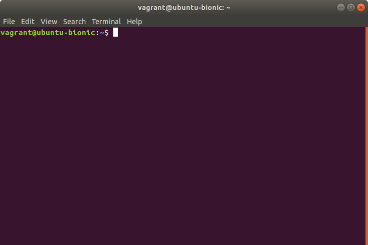

# Cropping, resizing and converting

Let’s say you have a bunch of screenshots like this one:

You want to get rid of everything except the text area in the middle. By selecting that region in GIMP you’ve established that it’s 729 pixels wide by 434 pixels tall and starts 0 pixels from the left side and 54 pixels below the top. You then want to resize it to 50% in both the X and Y directions to make it a quarter–size image. [ImageMagick](https://imagemagick.org/)’s `mogrify` can do both changes in a single command:

{lang=bash,crop-start-line=6}
<<[images/batch-processing.bash](./protected/code/src/images/batch-processing.bash)

The result:

You can stack as many operations as you want between the input and the output filenames. As you can see from the above they are applied left to right.

T> If you want to keep the original files you can use the `convert` command, which supports the same operations as `mogrify` but only operates on one file at a time. Its synopsis is `convert [INPUT_OPTION…] INPUT_FILE [OUTPUT_OPTION…] OUTPUT_FILE`.
